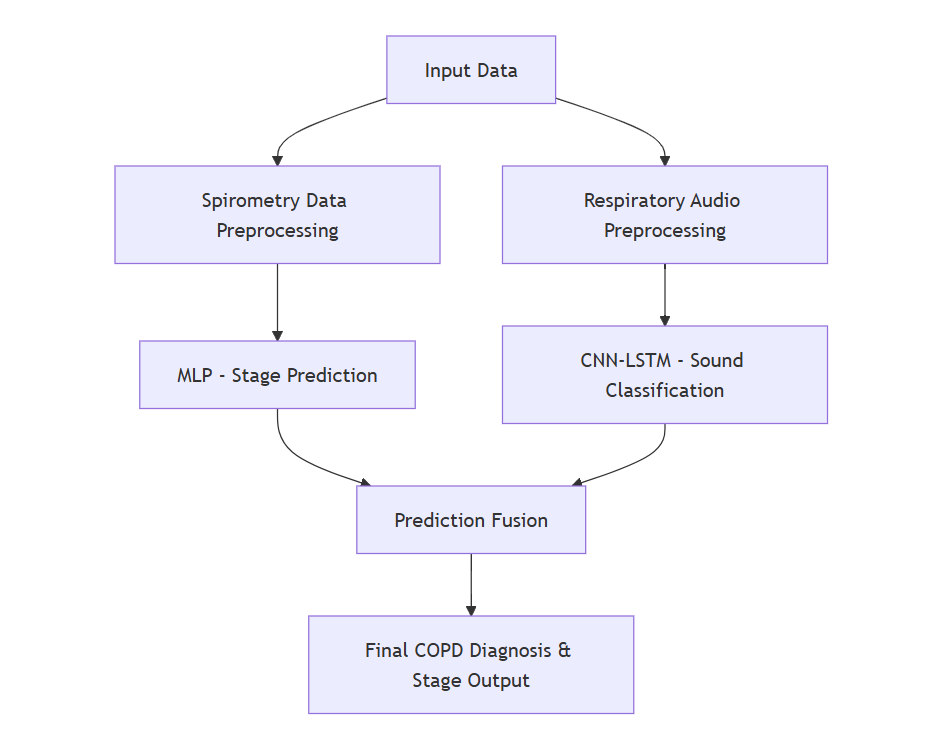

# 🫁 Multimodal Deep Learning Framework for Early COPD Prediction & Severity Stage Classification

## 📌 Overview  
This project implements a **dual Deep Learning–based system** designed for early diagnosis and accurate staging of **Chronic Obstructive Pulmonary Disease (COPD)**.  
Unlike traditional approaches that rely only on spirometry or binary classification of lung sounds, this framework **combines two complementary data sources**:

- 📊 **Structured spirometry & demographic data (FEV1, FVC, Age, BMI, Smoking History)**  
- 🎧 **Respiratory audio signals converted into MFCC features**

By integrating both modalities, the system achieves **98.19% accuracy** and **AUC = 0.99**, significantly outperforming single-modality baselines :contentReference[oaicite:0]{index=0}.

---

## 🎯 Key Features  
- Dual-model system combining:
  - **MLP** for COPD stage prediction  
  - **CNN–LSTM** for COPD vs Non-COPD lung sound classification  
- MFCC-based feature extraction for respiratory sounds  
- Automated preprocessing pipelines  
- Flask-based lightweight web deployment  
- Real-time, non-invasive respiratory assessment  
- High accuracy and clinically meaningful predictions
---

## 🧬 System Architecture

---
## 📂 Dataset Details

### **1️⃣ Structured Tabular Data (NHANES)**  
This dataset contains spirometry and demographic attributes such as:

- FEV1  
- FVC  
- Age  
- Sex  
- BMI  
- Smoking History  

**Dataset Split:**  
- **Training Samples:** 5,615  
- **Testing Samples:** 1,404  

---

### **2️⃣ Respiratory Audio Dataset (Kaggle Respiratory Sound Database)**  
The audio dataset includes `.wav` recordings labeled as:

- COPD  
- Asthma  
- Pneumonia  
- Bronchial Disorder  
- Healthy  

**Dataset Split:**  
- **Training Files:** 1,937  
- **Testing Files:** 485  

---

## 🛠️ Preprocessing Steps

### **Tabular Data (NHANES)**
- Missing value handling  
- Feature scaling (z-score normalization)  
- Label encoding for categorical attributes  
- Train/test split  

---

### **Audio Data (Lung Sounds)**
- Noise reduction (100–2000 Hz band-pass filter)  
- Segmentation into fixed-duration frames  
- MFCC feature extraction  
- Data augmentation (pitch shift, time-stretch, noise injection)  
- Normalization (0–1 scaling)  

---

## 🧠 Model Architectures

### **1️⃣ MLP — COPD Stage Prediction**
The MLP model uses spirometry + demographic features to classify:

- Mild  
- Moderate  
- Severe  

A confusion matrix in the research shows strong diagonal dominance, indicating high accuracy of stage prediction.

---

### **2️⃣ CNN–LSTM — Lung Sound COPD Classification**
- **CNN layers** extract spectral patterns from MFCCs  
- **LSTM layers** capture temporal breathing sequences  
- **Output:** COPD vs Non-COPD  

**Performance Highlights:**  
- **Accuracy:** 98.19%  
- **Precision:** 98%  
- **Recall:** 97.8%  
- **F1-Score:** 97.9%  
- **AUC:** 1.00  

---

## 📈 Results

### 🔹 CNN–LSTM Performance  
- Achieved **98.19% accuracy** for COPD sound classification  
- Near-perfect **AUC = 1.00**  
- Low overfitting and strong generalization  

### 🔹 MLP Stage Prediction  
- High accuracy across Mild, Moderate, Severe classes  
- Stable training vs validation curves  

### 🔹 Combined Framework  
- Merges COPD Presence + COPD Stage for final risk profile  
- Suitable for real-time and low-resource clinical environments  
- Deployed using a lightweight Flask web server  

## 🌟 Advantages of This Framework

- Multimodal fusion significantly improves diagnostic accuracy  
- Works effectively in low-resource clinical environments  
- Supports rapid screening and early COPD risk stratification  
- Reduces dependency on manual auscultation  
- Scalable architecture deployable on edge devices and lightweight servers  

---

## 🔮 Future Enhancements

- Integration of explainable AI methods (Grad-CAM, SHAP) for clinical transparency  
- Validation using diverse and real-world multi-center datasets  
- Support for wearable sensor data for continuous monitoring  
- Mobile-friendly and cross-platform deployment  
- Enhanced noise-robust models for real-world respiratory audio  

---

## 👩‍💻 Authors

- **Sanika H R**  
- **Manvanth G C**  
- **Vaishnavi S. Tandel**  
- **Manoj**

